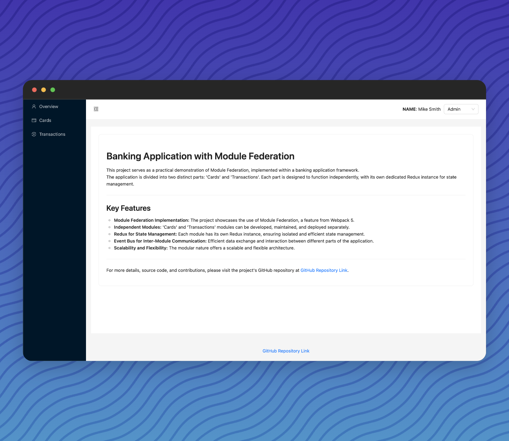
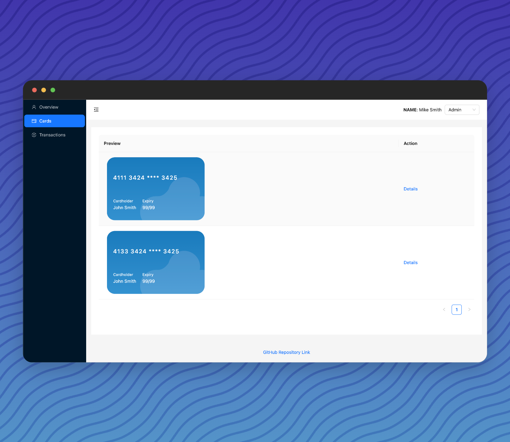
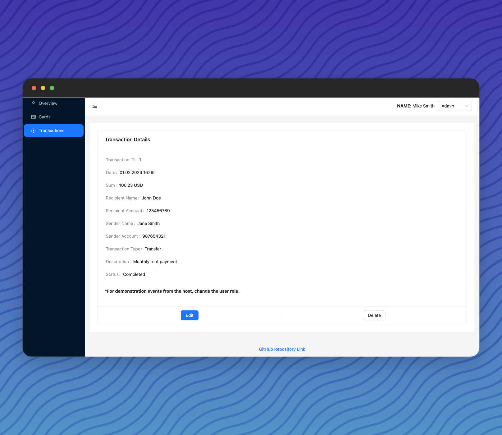
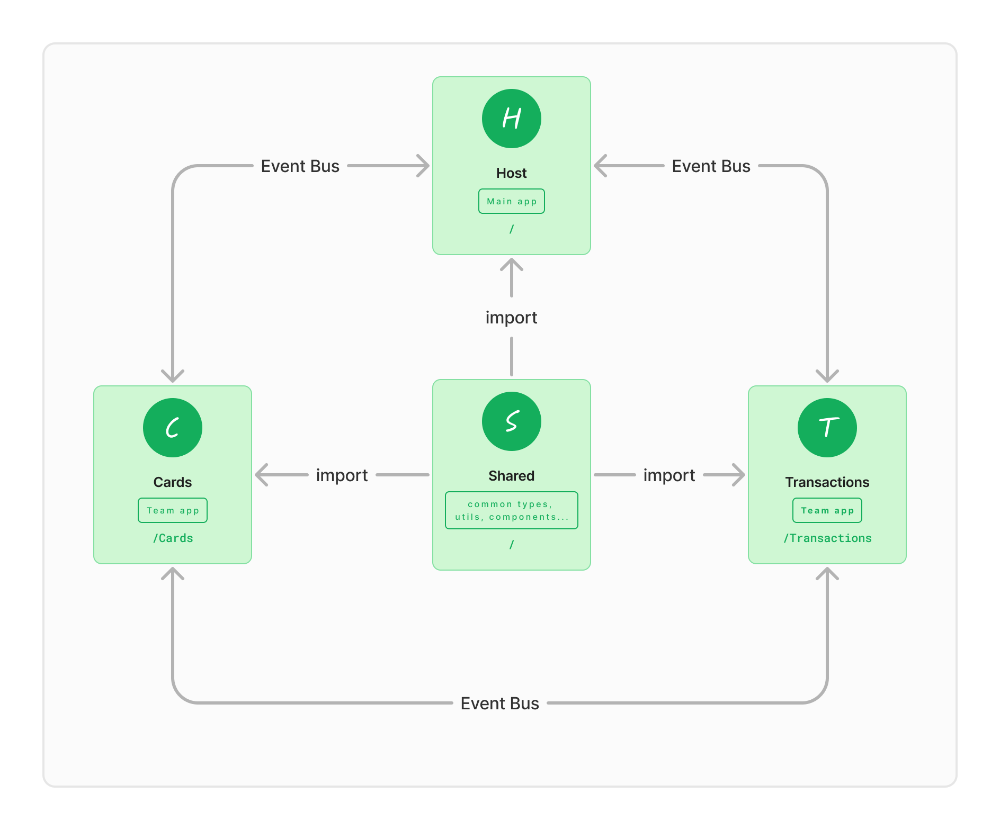

# Banking Application with Module Federation

This banking application is a showcase of Module Federation, a cutting-edge feature from Webpack 5, which allows for a scalable, flexible microfrontend architecture. Designed specifically for the finance sector, this application is divided into several independent modules, each with its unique functionality and managed state.

## Application Sections:

**Host App**: The central hub integrating all modules.

***Card App***: Focuses on user card functionalities.

**Transactions App**: Manages user transactions and related data.

The application's microfrontend approach, combined with state-of-the-art technologies and a focus on modular design, makes it an exemplary project in the realm of modern web development, particularly for complex financial applications.

## Key Features:

1. **Module Federation Implementation**: Utilizes Webpack 5's Module Federation to create a cohesive yet modular application.

2. **Independent Modules**: The application is split into 'Cards' and 'Transactions' modules. Each module operates independently, facilitating separate development, maintenance, and deployment processes.

3. **Redux for State Management**: Each module comes with its own Redux instance, ensuring isolated and effective management of the application state.

4. **Event Bus for Inter-Module Communication**: Implements an event bus for seamless data exchange and interaction between different modules, enhancing overall application performance and user experience.

## integration:

